<p align="center">
    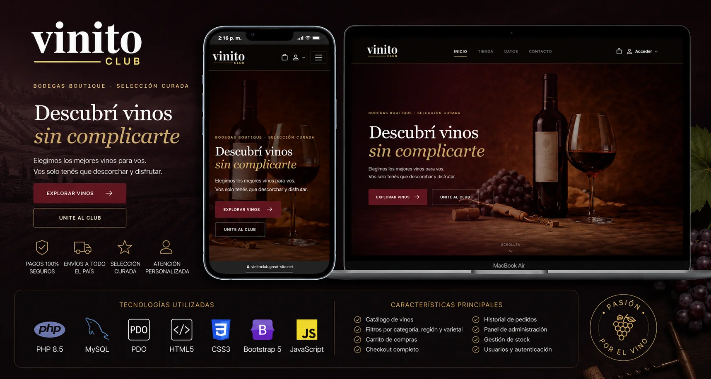
</p>

<h1 align="center">🍷 Vinito Club</h1>

<p align="center">
    <strong>E-commerce de vinos desarrollado desde cero con PHP 8.5 y MySQL.</strong>
</p>

<p align="center">


</p>

---

# 📖 Descripción

**Vinito Club** es un e-commerce de vinos desarrollado como proyecto final para la materia **Programación ll** En *Escuela Da vinci* .

El proyecto fue construido íntegramente utilizando **Programación Orientada a Objetos**, una **Base de Datos Relacional en MySQL** y una arquitectura modular basada en clases, aplicando buenas prácticas de desarrollo, seguridad y organización del código.

El sistema cuenta con una cara pública destinada a los clientes y un panel administrativo para la gestión completa del catálogo y de los pedidos.

---

# 📸 Vista previa

<p align="center">
    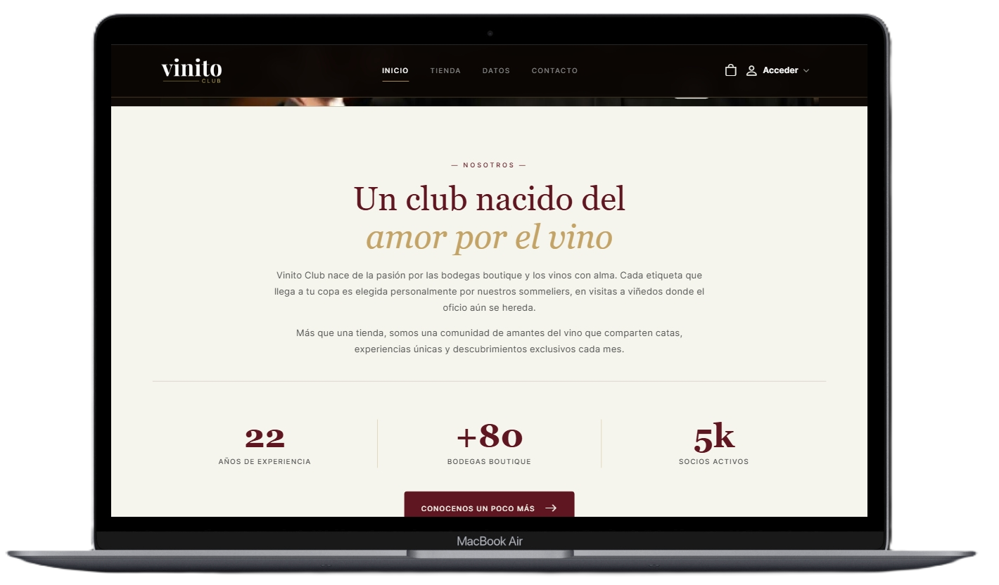
    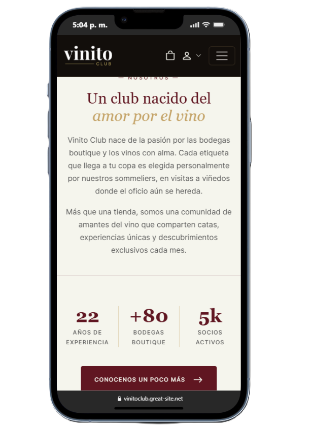
</p>

---

# ✨ Funcionalidades

## 👤 Cliente

- Registro e inicio de sesión
- Recordar sesión mediante Cookies
- Catálogo dinámico de vinos
- Filtros por:
  - Categoría
  - Región
  - Varietal
- Vista individual de productos
- Carrito de compras
- Validación automática de stock
- Checkout completo
- Historial de compras
- Perfil de usuario

---

## ⚙️ Administrador

- Dashboard con estadísticas
- Gestión de vinos
- Gestión de categorías
- Gestión de regiones
- Gestión de varietales
- Gestión de pedidos
- Cambio de estado de pedidos
- Confirmación antes de eliminar registros

---

# 🛠 Tecnologías utilizadas

| Backend | Frontend | Base de Datos |
|----------|-----------|---------------|
| PHP 8.5 | HTML5 | MySQL |
| PDO | CSS3 | phpMyAdmin |
| Programación Orientada a Objetos | Bootstrap 5 | MySQL Workbench |
| Sesiones | JavaScript | |

---

# 🧠 Conceptos implementados

- Programación Orientada a Objetos
- Arquitectura basada en clases
- CRUD completo
- Relaciones 1:N
- Relaciones N:M
- Tablas puente
- Base de Datos Relacional
- Normalización
- PDO
- Prepared Statements
- Protección contra SQL Injection
- Transacciones SQL
- Gestión de Sesiones
- Cookies
- Panel Administrativo
- Sistema de Autenticación
- Control de Stock
- Checkout completo

---

# 📷 Capturas

## 🏠 Inicio

<p align="center">
    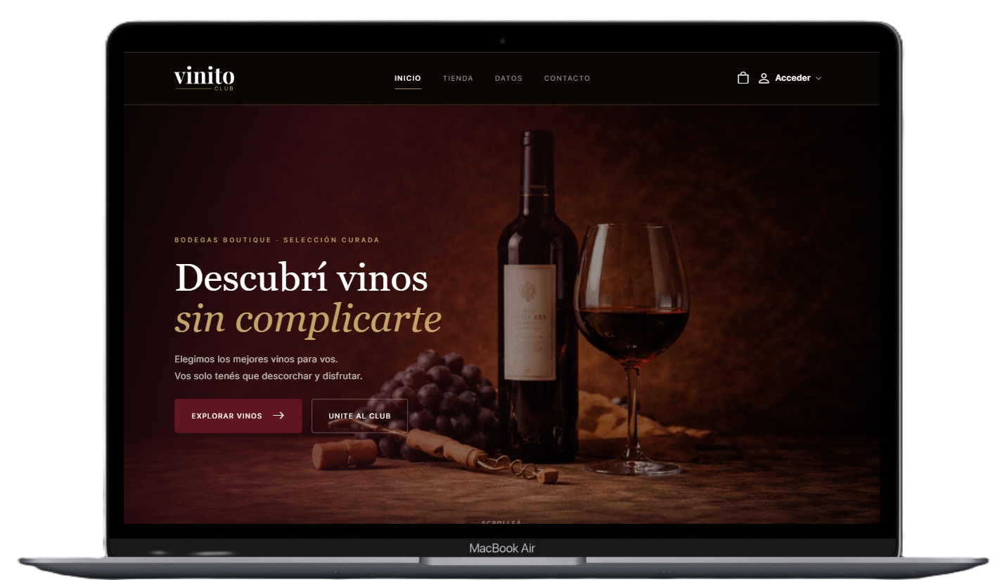
    
</p>

---

## 🏪 Tienda

<p align="center">
    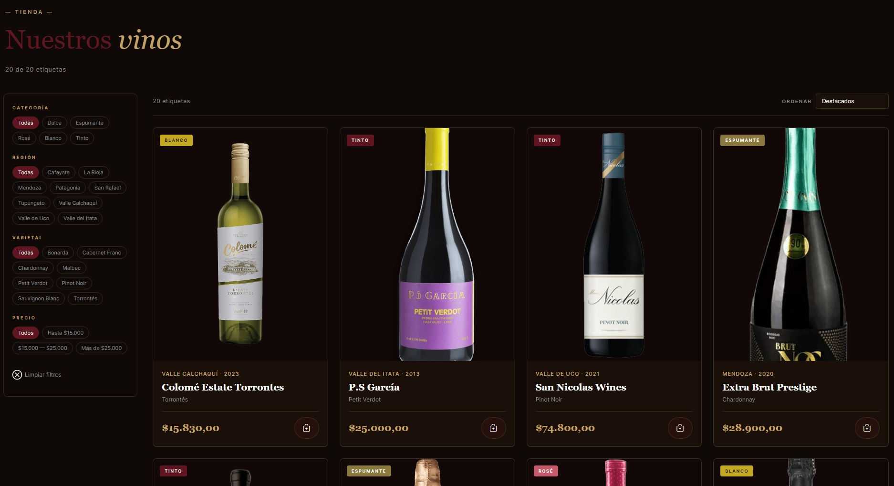
</p>

---

## 🛒 Carrito

<p align="center">
    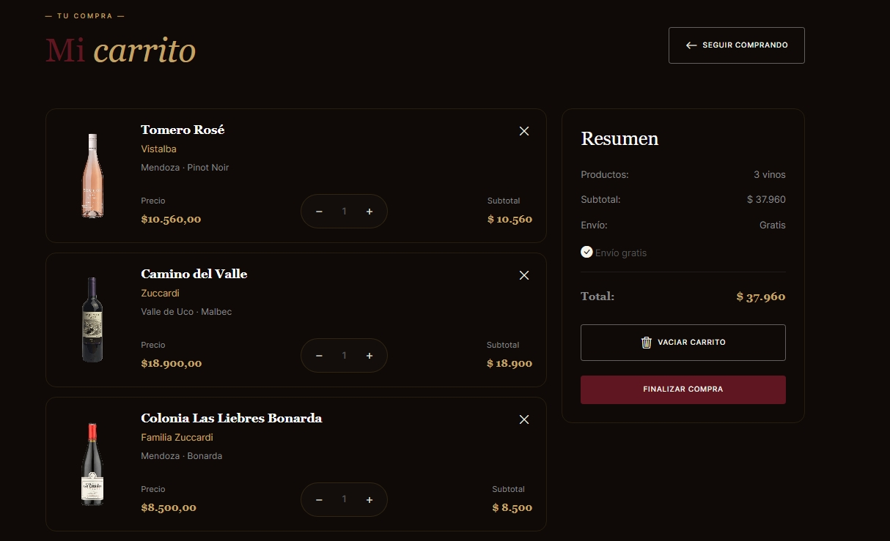
</p>

---

## 💳 Checkout

<p align="center">
    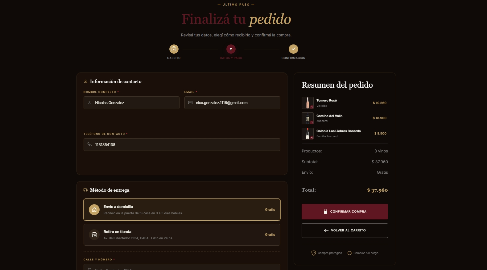
</p>

---

## 📊 Panel de Administración

### Dashboard

<p align="center">
    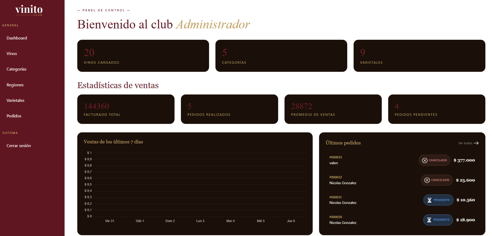
</p>

### Gestión de Vinos

<p align="center">
    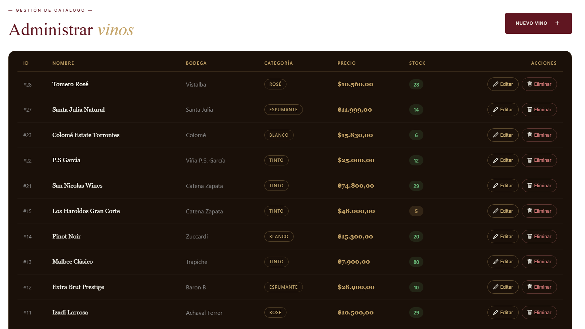
</p>

### Gestión de Pedidos

<p align="center">
    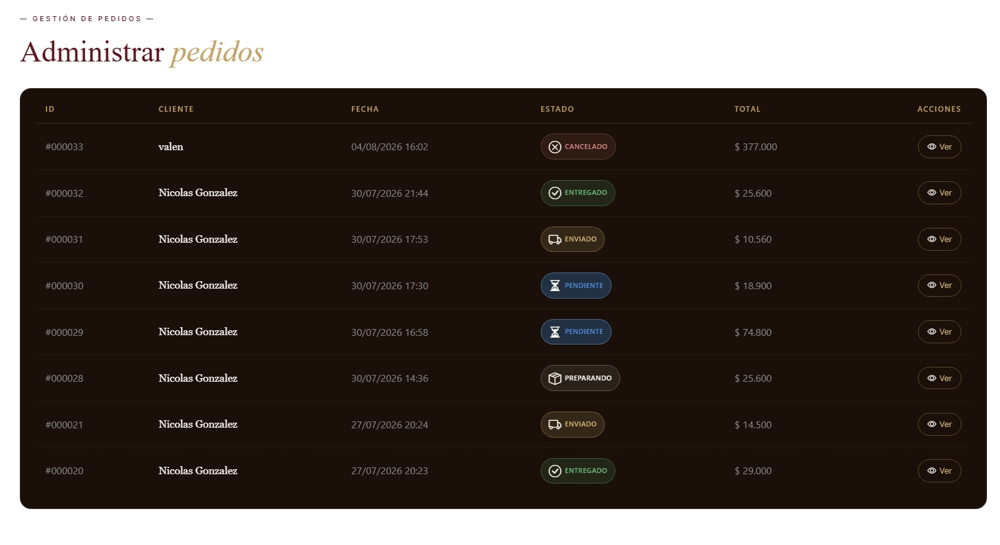
</p>

---

# 🗄 Base de Datos

La base de datos fue diseñada siguiendo principios de **normalización** y utilizando relaciones mediante claves primarias y foráneas.

Principales entidades:

- Usuarios
- Vinos
- Categorías
- Regiones
- Varietales
- Pedidos
- Detalle de pedidos
- Tabla puente vino_varietal

## DER

<p align="center">
    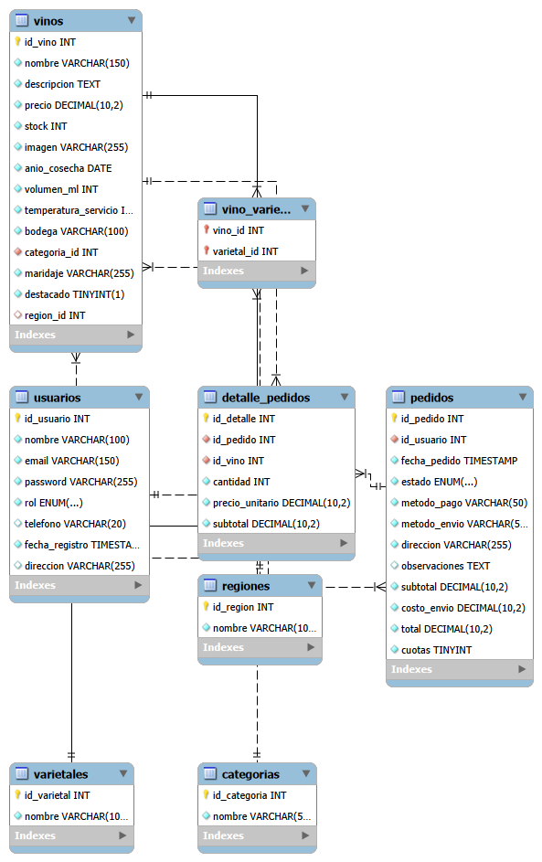
</p>

---

# 📂 Estructura del proyecto

```text
📦 vinito-club
├── acciones
├── admin
├── assets
├── classes
├── css
├── docs
│   └── images
├── includes
├── views
├── index.php
└── README.md
```

---

# 🚀 Instalación

## 1. Clonar el repositorio

```bash
git clone https://github.com/TU-USUARIO/vinito-club-main.git
```

---

## 2. Importar la Base de Datos

Importar el archivo `.sql` utilizando phpMyAdmin o MySQL Workbench.

---

## 3. Configurar la conexión

Editar:

```text
classes/Conexion.php
```

Con las credenciales correspondientes.

---

## 4. Ejecutar el proyecto

Levantar el servidor utilizando Laragon, XAMPP o similar.

---

# 💡 Lo aprendido

Durante el desarrollo de este proyecto se trabajó sobre:

- Arquitectura basada en clases
- Diseño de bases de datos relacionales
- Programación Orientada a Objetos
- CRUD completos
- Relaciones entre tablas
- Seguridad mediante PDO
- Validaciones de formularios
- Gestión de sesiones
- Cookies
- Transacciones SQL
- Desarrollo completo de un e-commerce

---

# 🔮 Posibles mejoras

- Integración con Mercado Pago
- Sistema de favoritos
- Recuperación de contraseña
- Dashboard con métricas avanzadas
- API REST
- Sistema de reseñas
- Búsqueda inteligente

---

# 👨‍💻 Autor

**Nicolás González/Neox06-Dev**

Proyecto desarrollado como trabajo final para la materia **Programación ll** en la carrera de **Diseño y Desarrollo Web**.

⭐ **Calificación obtenida en el final:** **10/10**

---

<p align="center">

Si este proyecto te resultó interesante, podés dejar una ⭐ al repositorio.

</p>
